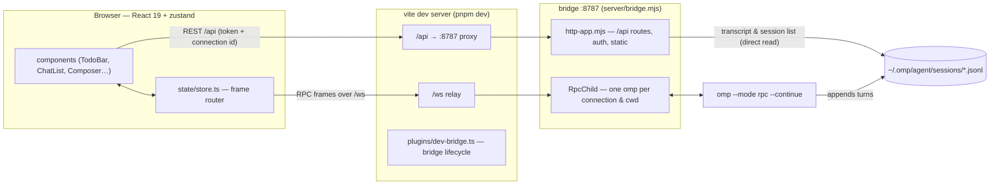
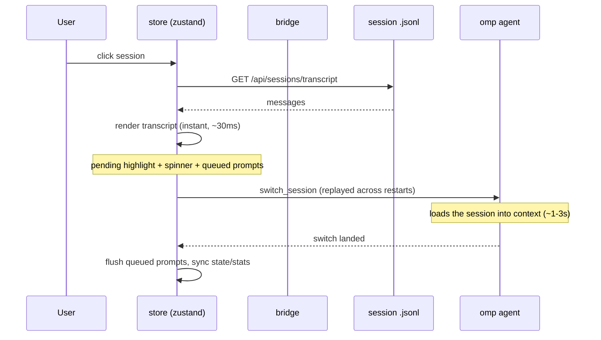
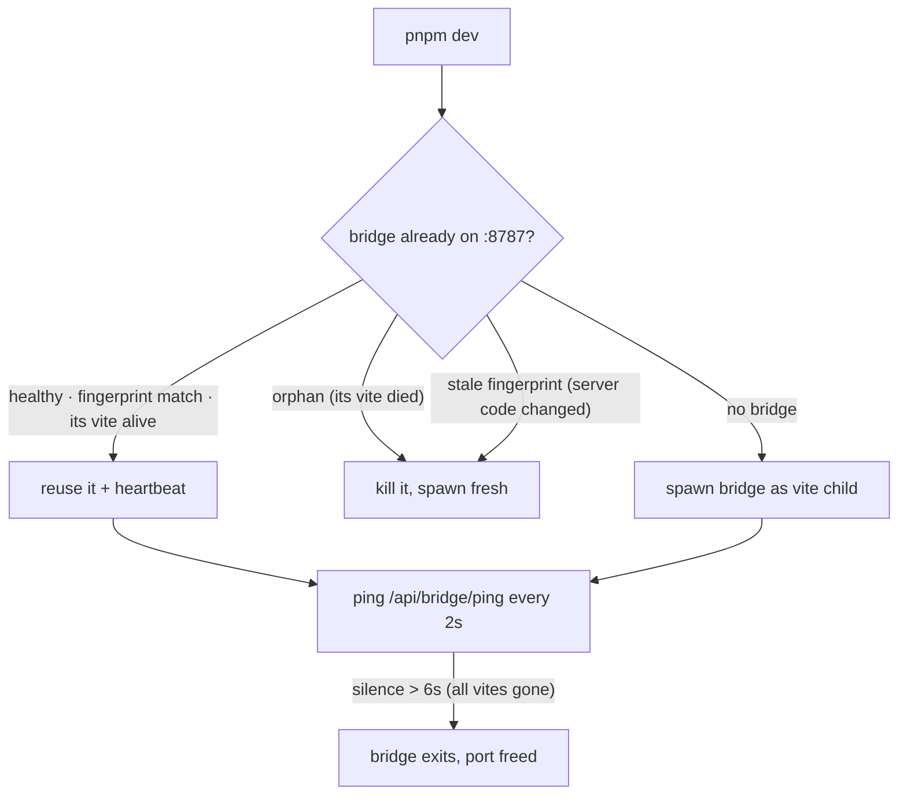

# omp web

English | [简体中文](./README.zh-CN.md)

A web user interface for the [oh-my-pi](https://github.com/can1357/oh-my-pi) coding agent.
This project ships **only the UI and the communication layer** — all agent capability lives in
your local `omp` binary; nothing is reimplemented here.


## Features

- **Sidebar + conversation layout** — session list (parsed from `~/.omp/agent/sessions`),
  search, new chat, rename, delete, connection status.
- **Instant session switching** — clicking a session renders its transcript immediately
  from the on-disk session file (bridge `/api/sessions/transcript`), while the agent's
  `switch_session` completes in the background. A prompt typed mid-switch is queued and
  auto-dispatched when the switch lands (restored to the composer if the switch fails);
  `switch_session` is replayed across agent restarts, so cross-project moves never roll
  the UI back. Switching to the displayed session is a no-op.
- **Windowed history** — long sessions render the most recent turns only; scrolling toward
  the top (or the expander button) loads earlier turns with scroll anchoring, so opening a
  huge transcript stays fast.
- **Live streaming turns** — text/thinking deltas, tool-call cards with live status, abort,
  follow-up queueing while streaming (`prompt` with `streamingBehavior: "followUp"`).
- **Copy & retry** — one-click copy on assistant conclusions, code blocks and tool output;
  a failed send gets an inline retry that re-dispatches its content.
- **Crash diagnostics** — when the agent child dies, the bridge forwards its last stderr
  lines with the exit event and the UI shows them in the reconnect notice.
- **Token consumption display** — per-message `↑input ↓output · cache · $cost · tok/s · model`
  chips, conversation totals and cost in the top bar, and a context-window usage meter
  (from `get_session_stats` / `get_state.contextUsage`).
- **Unified `/` command palette** — one popup for local commands, the agent's own pushed
  commands (`available_commands_update`: extensions, custom/file commands, MCP prompts),
  and the session's skills (with descriptions, icons, and full-width keyboard-navigable
  list): plan, goal, handoff, compact. No-arg commands run on pick; arg-taking ones
  insert their token for completion (skills as `/skill:<name>`, as upstream expects).
  `@` file references stay a separate popup.
- **Todo panel** — the session's task list (`get_state.todoPhases`, live-updated from
  `todo` tool runs, cleared by `todo_auto_clear`): per-phase progress, status icons
  (pending / in-progress / completed / abandoned / blocked). Starts collapsed to a
  progress pill and expands into the list panel with a View Transition morph anchored
  at the pill's corner (browsers without the View Transition API just toggle).
- **Plan mode** — mirror of omp's `/plan` (plan before executing). Prompts sent in plan mode
  are wrapped in a read-only planning contract that asks for the final plan in a fenced
  block tagged `plan`; the latest turn then gets a review bar with **Approve & implement**
  (exits plan mode) and copy. The top bar shows a Plan badge while active.
- **Goal mode** — mirror of omp's `/goal` (persistent autonomous objective). A goal banner
  shows the objective, status, and token-budget burn-down from native `goal_updated` events,
  with complete/resume/drop actions; `/goal <objective>` kicks off goal setup the same way
  omp's `/guided-goal` does (the agent creates the record with its `goal` tool). Plan and
  goal mode are mutually exclusive, as upstream.
- **Session handoff** — the native RPC `handoff` command (session menu and
  `/handoff [instructions]`): generates a handoff document, commits it as a compaction
  entry, and reloads the compacted transcript. Refuses mid-response, like the TUI.
- **Project & branch pickers** — project switcher (`/api/projects` → `/api/cwd`, with a
  filesystem browser) plus a git branch picker (`/api/branches`): list local branches,
  check out, or create + check out a new branch, operating in the agent's cwd.
- **Turn-end notifications** — optional browser notification (Notification API) when an
  agent turn finishes while the page is hidden; enabled from settings, which requests
  permission from its own toggle.
- **Install detection** — if the local `omp` binary is missing, a setup guide with
  per-platform install commands and a re-check button takes over the page.
- **Theming** — dark / light / system modes (default: dark) with a black graphite accent
  by default plus five preset accent colors (violet / blue / emerald / rose / amber),
  driven by the `--accent` token and switchable live from the sidebar.
- **Model & thinking pickers** — `get_available_models` → `set_model`, thinking levels →
  `set_thinking_level`; compaction button (`compact`).
- **Extension UI passthrough** — `select` / `confirm` / `input` / `editor` / `open_url`
  requests render as dialogs and answer via `extension_ui_response`.
- **Access token** — the bridge requires a token on `/api` and WebSocket: generated on
  first start (persisted at `~/.omp/web-bridge-token`, printed with a ready `?token=`
  link), pinned or disabled via `OMP_WEB_TOKEN`; the page unlocks itself from `?token=`
  or the in-app token gate.

## Architecture



- **`server/bridge.mjs`** — Node process owning one `omp --mode rpc` child per WebSocket
  connection, with a per-connection working directory (tabs can sit in different projects).
  Negotiates **protocol v2** on the child's `ready` frame, reassembles `rpc_chunk`
  sequences server-side, guards the uplink (origin checks, frame size cap), and forwards
  clean frames both ways. A parent watchdog exits the bridge when its vite dies (raw PID
  probe + a `/api/bridge/ping` heartbeat, so a recycled Windows PID can't keep an orphan
  alive).
- **`server/http-app.mjs`** — the HTTP application (origin guard, all `/api` routes,
  static dist/), testable in isolation via an injected context; service modules beside it:
  `session-store.mjs` (listing/deletion + `readSessionTranscript` for the fast switch),
  `workspace-files.mjs` (@-mention search), `skills.mjs`, `git-branches.mjs`,
  `scratch.mjs` (oversized-prompt offload), `fs-browse.mjs`, `origin-guard.mjs`,
  `session-meta.mjs`, `rpc-frame.mjs`.
- **`plugins/dev-bridge.ts`** — vite dev plugin owning the bridge lifecycle: spawns the
  bridge as a child (killed with the vite tree), heartbeats it every 2s, and on startup
  **replaces** any port occupant that is orphaned (its vite died) or runs stale server
  code (fingerprint of `server/*.mjs` exposed via `/api/health`) — a quick close-and-restart
  never inherits stale bridge behavior. Also relays `/ws` to keep reconnect noise out of
  the console.
- **`src/rpc/`** — wire types single-sourced from the `@omp-web/protocol` workspace
  package + a reconnecting WebSocket RPC client with id correlation, in-flight
  idempotency coalescing, and replay of read-only (plus `switch_session`) requests
  across reconnects.
- **`src/state/store.ts`** — frame router: `message_update` partials → live streaming
  bubble, `tool_execution_*` → tool cards, `goal_updated` → goal banner, terminal
  `agent_end` → transcript reconciliation + stats refresh + optional turn-end notification,
  `extension_ui_request` → dialog stack, plus the optimistic session-switch flow
  (below).
- **`src/lib/`** — pure, unit-tested helpers: slash-command parsing + palette
  (`slash.ts`), plan-mode contract (`planMode.ts`), goal prompts (`goalMode.ts`),
  notifications (`notify.ts`), formatting, theme, pins, idempotency.

### Fast session switching



The transcript on screen comes from the same `.jsonl` the agent reads, so the
optimistic render matches what the agent later serves. Cross-project switches
additionally restart the agent child for the target cwd (`POST /api/cwd`);
`switch_session` is marked replayable, so the in-flight request re-issues against
the fresh agent instead of failing. If the switch is refused or fails, the previous
transcript is restored and a queued prompt returns to the composer.

### Dev lifecycle (vite ↔ bridge)



## Usage

```sh
pnpm install
pnpm dev          # bridge on :8787 + vite dev server on :9527 (proxied)
```

The dev lifecycle is self-healing: the bridge runs as a vite child and exits when vite
dies (heartbeat watchdog, ~6s), and a restarting vite replaces an orphaned or stale-code
bridge automatically — no need to hunt stray processes after a crash.

Production (single process serves UI + WS + REST):

```sh
pnpm build
pnpm start        # http://127.0.0.1:8787
```

Requires `omp` on `PATH` (override with `OMP_BIN`, plus `OMP_CWD`, `OMP_ARGS`, `PORT`, `HOST`,
and `OMP_WEB_TOKEN` to pin or disable the access token).
The branch picker additionally needs `git` on the bridge's PATH. Oversized prompts are
written to `<project>/.omp/scratch/` and referenced as files — add that directory to the
project's `.gitignore` if you commit the repo.

The bridge binds `127.0.0.1` and requires an **access token**: a random token is generated
on first start (persisted at `~/.omp/web-bridge-token`, printed to the console with a
ready-made `http://127.0.0.1:8787/?token=…` link). The page consumes `?token=` once and
keeps it in localStorage; `/api` calls and WebSocket upgrades without a valid token get
401. Set `OMP_WEB_TOKEN=<token>` to pin one, or `OMP_WEB_TOKEN=off` to disable auth
entirely. Cross-origin requests from non-loopback origins are rejected, so browsing other
sites while omp-web is running cannot drive the bridge (the exotic DNS-rebinding route is
otherwise the documented exception — see `server/origin-guard.mjs`).

```sh
pnpm vitest run                            # unit tests (pure helpers + server modules)
node scripts/smoke.mjs                     # handshake: ready → v2 → state/stats/models
WS_URL=ws://127.0.0.1:8788/ws node scripts/smoke.mjs --prompt "hi"  # full streamed turn
node scripts/theme-shots.mjs               # default theme + accent preset screenshots
node scripts/recovery-test.mjs             # install-guide → refresh → chat recovery flow
node scripts/screenshot.mjs                # headless-Edge screenshots, light+dark
```
