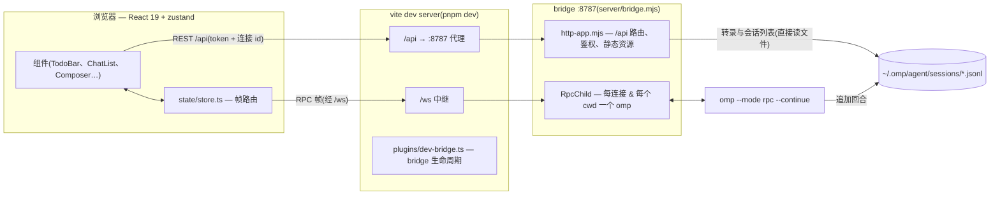
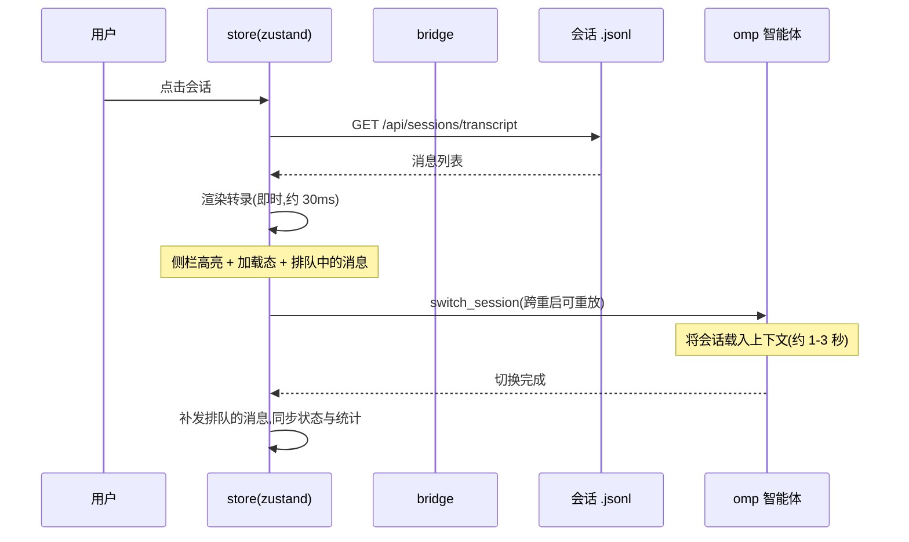
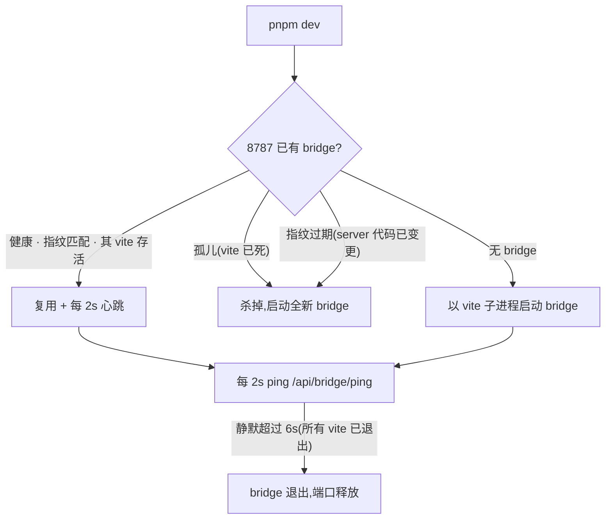

# omp web

[English](./README.md) | 简体中文

[oh-my-pi](https://github.com/can1357/oh-my-pi) 编码智能体的 Web 界面。
本项目只提供**界面与通信层** —— 全部智能体能力都在你本地的 `omp` 可执行文件中,这里不做任何重新实现。


## 功能

- **侧边栏 + 对话布局** — 会话列表(解析 `~/.omp/agent/sessions`)、搜索、新建对话、
  重命名、删除、连接状态。
- **会话秒切** — 点击会话即刻从磁盘上的会话文件渲染转录(bridge
  `/api/sessions/transcript`),智能体的 `switch_session` 在后台完成。切换期间输入的
  消息自动排队、切换落地后补发(切换失败则退回输入框);`switch_session` 跨智能体
  重启可重放,跨项目切换不会回滚界面。点击当前已显示的会话不产生任何请求。
- **窗口化历史** — 长会话只渲染最近的回合;向上滚动(或点击展开按钮)按需加载更早的
  回合并做滚动锚定,打开超大转录依然流畅。
- **实时流式回合** — 文本/思考增量、带实时状态的工具调用卡片、中止、流式期间排队追问
  (`prompt` + `streamingBehavior: "followUp"`)。
- **复制与重试** — 助手结论、代码块、工具输出一键复制;发送失败的消息内联重试,
  原样重新派发。
- **崩溃诊断** — agent 子进程退出时,bridge 将其最后若干行 stderr 随退出事件转发,
  UI 在重连通知中展示。
- **Token 消耗展示** — 单条消息的 `↑input ↓output · cache · $cost · tok/s · model` 标签,
  顶栏的会话总量与费用,以及上下文窗口用量环
  (来自 `get_session_stats` / `get_state.contextUsage`)。
- **统一 `/` 命令面板** — 一个弹窗同时承载本地命令、智能体推送的命令
  (`available_commands_update`:扩展、自定义/文件命令、MCP prompt)与会话技能(带描述、
  图标、全宽、键盘可导航):plan、goal、handoff、compact。无参数命令选中即执行;带参数
  命令插入命令 token 供补全(技能按上游约定插入 `/skill:<name>`)。`@` 文件引用仍是
  独立弹窗。
- **任务清单面板** — 会话任务列表(`get_state.todoPhases`,todo 工具运行实时更新,
  `todo_auto_clear` 清空):分阶段进度、状态图标(pending / in-progress / completed /
  abandoned / blocked)。默认收起为进度胶囊,点击后以 View Transition 形变展开为列表
  面板(锚定在胶囊角上;不支持的浏览器直接切换)。
- **规划模式(Plan mode)** — 对应 omp 的 `/plan`(先规划后执行)。规划模式下的 prompt
  会被包进只读规划契约,要求把最终计划放进标记为 `plan` 的围栏代码块;最新回合随后
  出现审阅栏,提供**批准并实施**(退出规划模式)与复制操作。激活时顶栏显示规划徽章。
- **目标模式(Goal mode)** — 对应 omp 的 `/goal`(会话级持久自主目标)。目标横幅基于原生
  `goal_updated` 事件展示目标、状态与 token 预算燃尽条,并提供完成/恢复/放弃操作;
  `/goal <objective>` 以与 omp `/guided-goal` 相同的方式引导建档(由智能体用自己的
  `goal` 工具创建)。规划模式与目标模式互斥,与上游一致。
- **会话交接(Handoff)** — 原生 RPC `handoff` 命令(会话菜单与 `/handoff [instructions]`):
  生成交接文档、作为压缩条目提交,并重载压缩后的转录。与 TUI 一样,响应进行中拒绝执行。
- **项目与分支选择器** — 项目切换器(`/api/projects` → `/api/cwd`,带文件系统浏览器)
  与 git 分支选择器(`/api/branches`):列出本地分支、签出、或创建并签出新分支,
  操作作用于 agent 当前工作目录。
- **回合结束通知** — 可选的浏览器通知(Notification API):回合结束且页面处于后台时提醒;
  在设置中开启,开启即以该次点击为用户手势申请权限。
- **安装检测** — 未找到本地 `omp` 可执行文件时,页面切换为带各平台安装命令与重新检测
  按钮的安装引导。
- **主题** — 深色 / 浅色 / 跟随系统(默认深色),默认石墨黑主色,另有五种预设主色
  (紫罗兰 / 蓝 / 翠绿 / 玫红 / 琥珀),由 `--accent` token 驱动,可在侧边栏实时切换。
- **模型与思考等级选择** — `get_available_models` → `set_model`,思考等级 →
  `set_thinking_level`;压缩按钮(`compact`)。
- **扩展 UI 透传** — `select` / `confirm` / `input` / `editor` / `open_url` 请求渲染为
  对话框,并通过 `extension_ui_response` 应答。
- **访问令牌** — bridge 的 `/api` 与 WebSocket 要求访问令牌:首次启动自动生成
  (持久化于 `~/.omp/web-bridge-token`,控制台打印带 `?token=` 的现成链接),可用
  `OMP_WEB_TOKEN` 固定或关闭;页面从 `?token=` 或应用内令牌门自行解锁。

## 架构



- **`server/bridge.mjs`** — Node 进程,为每个 WebSocket 连接持有一个 `omp --mode rpc`
  子进程,工作目录按连接隔离(多个标签页可停留在不同项目)。在子进程 `ready` 帧时协商
  **协议 v2**,在服务端重组 `rpc_chunk` 序列,对上行做守卫(origin 校验、帧大小上限),
  双向转发干净帧。父进程看门狗在 vite 死亡时退出 bridge(PID 探测 + `/api/bridge/ping`
  心跳双信号,Windows PID 复用也不会残留孤儿)。
- **`server/http-app.mjs`** — HTTP 应用层(origin 守卫、全部 `/api` 路由、静态 dist/),
  通过注入上下文可独立测试;旁边的服务模块:`session-store.mjs`(会话列出/删除 +
  `readSessionTranscript` 秒切直读)、`workspace-files.mjs`(@-mention 搜索)、
  `skills.mjs`、`git-branches.mjs`、`scratch.mjs`(超长 prompt 落盘)、`fs-browse.mjs`、
  `origin-guard.mjs`、`session-meta.mjs`、`rpc-frame.mjs`。
- **`plugins/dev-bridge.ts`** — vite 开发插件,负责 bridge 生命周期:以子进程方式启动
  bridge(随 vite 进程树退出),每 2 秒心跳一次;启动时**替换**端口上的孤儿(其 vite
  已死)或运行旧服务代码的实例(通过 `/api/health` 暴露的 `server/*.mjs` 指纹比对)
  ——快速关闭重启不会继承旧行为。同时中继 `/ws`,避免 vite 代理在流式中刷新页面时
  刷屏的堆栈噪声。
- **`src/rpc/`** — 线上类型单一来源于 `@omp-web/protocol` workspace 包 + 带请求关联、
  在途幂等合并、断线重连请求重放(只读命令与 `switch_session`)的 WebSocket
  自动重连客户端。
- **`src/state/store.ts`** — 帧路由:`message_update` 增量 → 流式气泡,`tool_execution_*`
  → 工具卡片,`goal_updated` → 目标横幅,终态 `agent_end` → 转录对账 + 统计刷新 +
  可选的回合结束通知,`extension_ui_request` → 对话框栈;以及会话秒切的乐观流程(见下)。
- **`src/lib/`** — 纯函数、可单测的辅助层:斜杠命令解析与面板(`slash.ts`)、规划模式
  契约(`planMode.ts`)、目标提示词(`goalMode.ts`)、通知(`notify.ts`)、格式化、
  主题、置顶、幂等(`idempotency.ts`)。

### 会话秒切



屏幕上的转录与智能体读取的是同一个 `.jsonl`,乐观渲染与后续智能体视图一致。
跨项目切换会额外为目标 cwd 重启智能体子进程(`POST /api/cwd`);`switch_session`
标记为可重放,在途请求会对着新智能体重发而不是失败。切换被拒绝或失败时,
恢复之前的转录,排队的消息退回输入框。

### 开发生命周期(vite ↔ bridge)



## 使用

```sh
pnpm install
pnpm dev          # bridge 运行在 :8787,vite 开发服务器运行在 :9527(已代理)
```

开发生命周期自愈:bridge 以 vite 子进程运行,vite 退出后 bridge 会在心跳静默(约 6 秒)
内自行退出;重启 vite 时会自动替换孤儿或旧代码的 bridge——崩溃后无需手动清理残留进程。

生产模式(单进程同时提供 UI + WS + REST):

```sh
pnpm build
pnpm start        # http://127.0.0.1:8787
```

要求 `omp` 在 `PATH` 中(可用 `OMP_BIN` 覆盖,另有 `OMP_CWD`、`OMP_ARGS`、`PORT`、`HOST`,
以及用于固定/关闭访问令牌的 `OMP_WEB_TOKEN`)。
分支选择器还要求 bridge 的 PATH 中有 `git`。超长 prompt 会写入 `<project>/.omp/scratch/`
并以文件引用发送 —— 若该项目本身是 git 仓库,建议把该目录加入 `.gitignore`。

bridge 绑定 `127.0.0.1` 且要求**访问令牌**:首次启动生成随机令牌(持久化于
`~/.omp/web-bridge-token`,控制台打印现成的 `http://127.0.0.1:8787/?token=…` 链接)。
页面会一次性消费 `?token=` 并存入 localStorage;无有效令牌的 `/api` 请求与 WebSocket
升级一律 401。设 `OMP_WEB_TOKEN=<token>` 固定令牌,设 `OMP_WEB_TOKEN=off` 彻底关闭鉴权。
来自非环回地址的跨源请求会被拒绝,因此 omp-web 运行期间浏览其他网页无法驱动 bridge
(DNS 重绑定是文档中注明的例外,见 `server/origin-guard.mjs`)。

```sh
pnpm vitest run                            # 单元测试(纯函数 + 服务端模块)
node scripts/smoke.mjs                     # 握手:ready → v2 → state/stats/models
WS_URL=ws://127.0.0.1:8788/ws node scripts/smoke.mjs --prompt "hi"  # 完整流式回合
node scripts/theme-shots.mjs               # 默认主题 + 预设主色截图
node scripts/recovery-test.mjs             # 安装引导 → 刷新 → 对话恢复流程
node scripts/screenshot.mjs                # 无头 Edge 截图,浅色 + 深色
```
